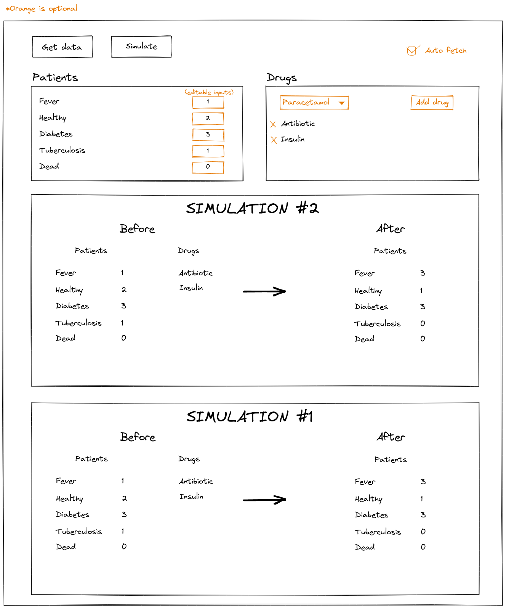

# Hospital coding challenge

We would like to ask you to do a fun coding exercise to have a deeper understanding of your coding skills. Imagine that your code will be read and modified by other developers, so they should be able to understand it easily. You should also remember that code should be easily extensible, maintainable, and scalable, but at the same time beware of overly complicated solutions.

Last but not least: there is no single best solution, so we encourage you to design and implement the solution in a way you think is right.

This exercise will be composed of two parts:
  1. Creation of a small library implementing the core logic of the problem;
  2. Creation of a UI using this library.

The project structure we provide you is divided as follows:
  - *hospital-lib* will contain the implementation of the library (Part 1 of this document);
  - *hospital-fe* will contain the implementation of the UI (Part 2 of this document);
  - *hospital-be* is a small nodejs backend that we provide (its usage is explained below - it acts as the hospital’s server).

## Problem description

You were asked by a doctor friend to prepare for her a “Hospital simulator”, which can simulate the future patients’ state, based on their current state and a list of drugs they take.

Patients can have one of these states:
  - F: Fever
  - H: Healthy
  - D: Diabetes
  - T: Tuberculosis
  - X: Dead

In the “Hospital simulator”, drugs are provided to all patients. It is not possible to target a specific patient. This is the list of available drugs:
  - As: Aspirin
  - An: Antibiotic
  - I: Insulin
  - P: Paracetamol

Drugs can change patients’ states. They can cure, cause side effects or even kill a patient if not properly prescribed.

Drugs effects are described by the following rules:
  - Aspirin cures Fever;
  - Antibiotic cures Tuberculosis;
  - A sick patient not receiving the right medicines remains sick, if not explicitly mentioned otherwise;
  - Insulin prevents diabetic subject from dying, does not cure Diabetes;
  - If insulin is mixed with antibiotic, healthy people catch Fever;
  - Paracetamol cures Fever;
  - Paracetamol kills subject if mixed with aspirin.

While applying the rules, please keep in mind that:
  - **During one simulation a patient can change his state only once (only one rule can be applied).**
  - **Rules causing Death take precedence over others.**

## Part 1. Creating the library *(hospital-lib)*

The goal is here to create a library implementing the specifications mentioned above. We provide you with a basic test file (*quarantine.spec.ts*) for the main test cases. Feel free to enrich it and create other tests for your internal code.

**Reminder.** Make sure that your solution is easily scalable in term of new patient states and new drugs, and extensible to new type of rules. Also, make sure that your code is well tested.

### Implementation

You need to complete the *Quarantine* class that must provide:
  - A **constructor**.
  
    The argument of the constructor is an object describing the states of the patients, following the format: `{F:NP,H:NP,D:NP,T:NP,X:NP}`. Where:
    - F, H, D, T, X are patients’ health status codes;
    - NP is a number of patients for a given state, 0 included;

    E.g. `{F:0,H:2,D:0,T:0,X:1}` means there are two healthy patients and one that is dead.
    
  - A method **setDrugs** that should define which drugs will be given to all patients.

    The argument to this method is an array of drugs codes, e.g. [“As”,“I”] means patients will be treated with Aspirin and Insulin;

  - A method **wait40Days** that will administer the drugs to the patients;

  - A method **report** that should return an object describing the current states of the patients, following the same format as the constructor argument.

## Technical information

A basic skeleton in TypeScript is provided in the *hospital-lib* folder. You **must** use it, otherwise your test will not be considered.

To run the tests, run the following commands in the *hospital-lib* folder:

 - `npm install`
 - `npm test` - to run the basic predefined tests

## Part 2. Creating the UI *(hospital-fe)*

The doctor is now happy with the lib that you created containing the core logic, but as she is not a developer, she cannot use it as such. This is why she now asks you to create for her a small UI that she could use to view her patients and simulate the effect of the drugs on them.

The hospital owns a small server (*hospital-be* – we provide it) that stores the list of current patients as well as the drugs that we want to administer to them. The goal is to create a UI that can be used to simulate the effect of drugs on the patients. It should contain:

  - A button used to retrieve the patients and drugs from the server and to display them on the screen;
  - Another button to administer the drugs to the patients (using the lib created in Part 1) and display the result of the simulation on the screen;
  - A result must contain the input and output and must be displayed as part of a history of all results;
  - The last 10 simulations results must be displayed (not more);
  - Everything must be displayed on the same screen.

## Technical information

Your frontend solution must be stored in the *hospital-fe* folder and must be written in VueJS or AngularX ***if nothing was explicitly defined.***

**Once your frontend is bootstrapped**, in order to use *hospital-lib* in your frontend, you should execute the following command in the *hospital-lib* folder:

```
npm run build:prod
```

Then in the *hospital-fe* folder add in the dependencies of your *package.json* the following dependency:

```json
// package.json of your frontend application
{
  // ...
  "dependencies": {
    // ...
    "hospital-lib": "file:../hospital-lib"
    // ...
  },
  // ...
}
```

Now, run again `npm install` in your project, and you should be able to use *hospital-lib* like this:

`import { Quarantine } from 'hospital-lib';`

## Using the Hospital server *(hospital-be)*

To run the server, execute the following commands in the hospital-be folder:

  - `npm install`
  - `npm start`

The server is then accessible through the url http://localhost:7200. It provides two endpoints (the formats follow the ones given in the test file of the library implemented in part 1):

  - `GET /patients`
    
    Returns a string containing the list of current patients in the hospital. E.g. "D,F,F”.
  - `GET /drugs`
    
    Returns a string containing the list of drugs to administer to the patients. E.g. “As,I”.

## Optional. Expanding the UI

If you find this exercise cool and still have time to spend, here are two improvements you may want to add to your solution:

<dl>
  <dt>
    Opt-1
  </dt>
  <dd>
    Allow the user to manually input patients and/or drugs instead of calling the server;
  </dd>
  <dt>
    Opt-2
  </dt>
  <dd>
    Propose an “automatic refresh” toggle that will, when enabled, call the server every 30 seconds to get the new list of patients and drugs and administrate them to add a new element in the history.
  </dd>
</dl>


## Idea of design

Thinking a UI with good UX is not an easy task. You can get some inspiration from the image below. This design is just here as an indication, and you can modify your UI at your own discretion. In such case, keep in mind that your solution must be simple yet clear and usable (we value user-friendliness).



As indicated in the image, the orange parts are optionnal. For the patients card, there should be either the number of patients in plain text,
or an input where the user can enter a value, should you choose to do this optionnal part. Clicking on the button to fetch data should fill this input.